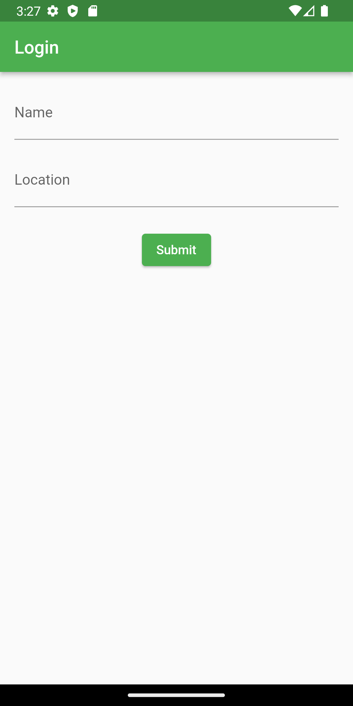
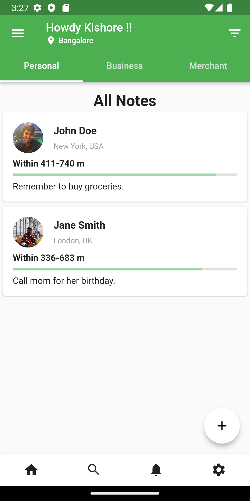
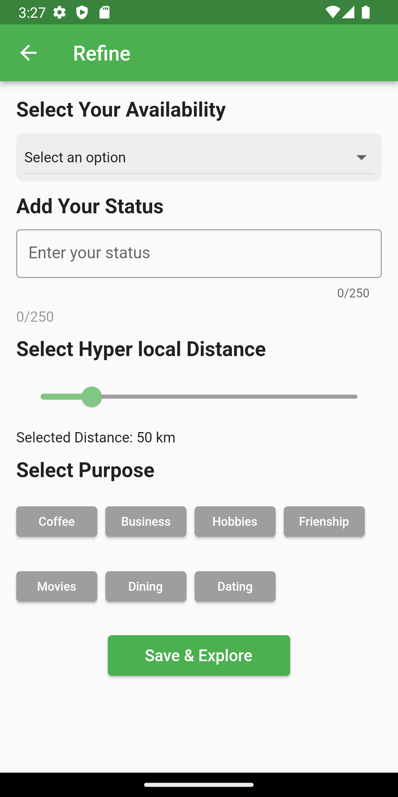

# Netclan Sample

This is a Flutter project that includes login functionality and a display page with various options similar to the netclan and its created for interview purposes only.

## Screenshots
 
 Login Screen
  
  

Explore Screen
   
   

Refine Screen
   
   
  

## Getting Started

To get started with this project, follow these steps:

1. Clone the repository to your local machine:

   git clone https://github.com/your-username/flutter-project.git

2. Open the project in your preferred Flutter IDE (e.g., Android Studio, Visual Studio Code).

3. Install the necessary dependencies by running the following command in the terminal:

   flutter pub get

4. Connect a device or start an emulator/simulator.

5. Run the application using the following command:

   flutter run

## Features

- **Login Page:** Allows users to enter their name and location and navigate to the display page.
- **Display Page:** Displays user information, including name and location. Allows users to refine their settings.
- **Refine Page:** Allows users to select their availability, add a status, set a hyperlocal distance, and choose a purpose.
- **Add Card:** Allows users to add note cards with a username, location, note, and optional photo.

## Dependencies

This project uses the following dependencies:

- `flutter/material`: The Flutter framework for building UI components.
- `image_picker`: A plugin for picking images from the image library or camera.
- `dart:math`: The core Dart library for mathematical operations.

## Contributing

Contributions are welcome! If you find any issues or want to add new features, feel free to submit a pull request.

## License

This project is licensed under the [MIT License](LICENSE).

